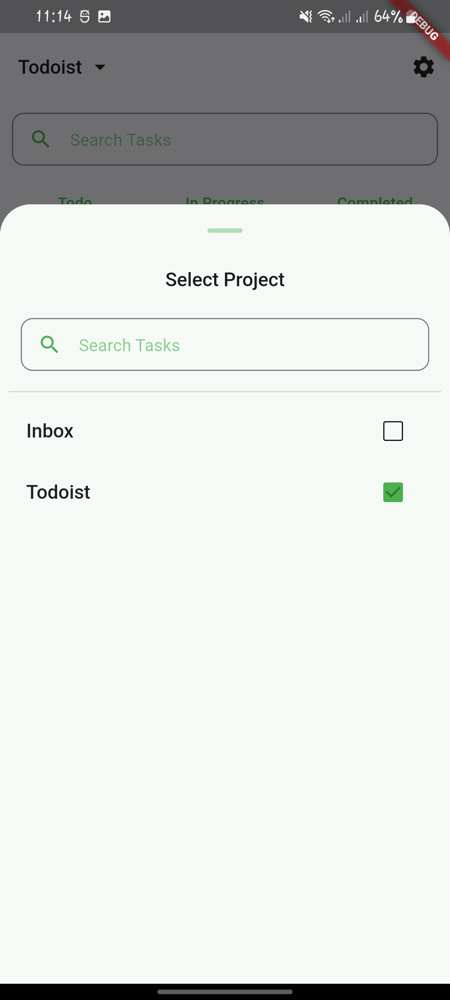
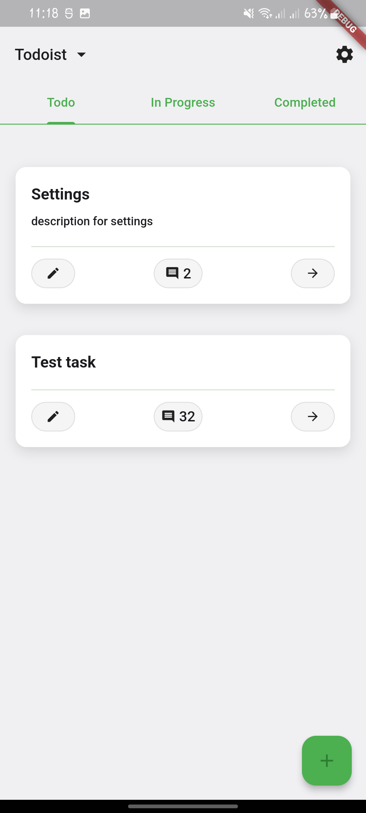
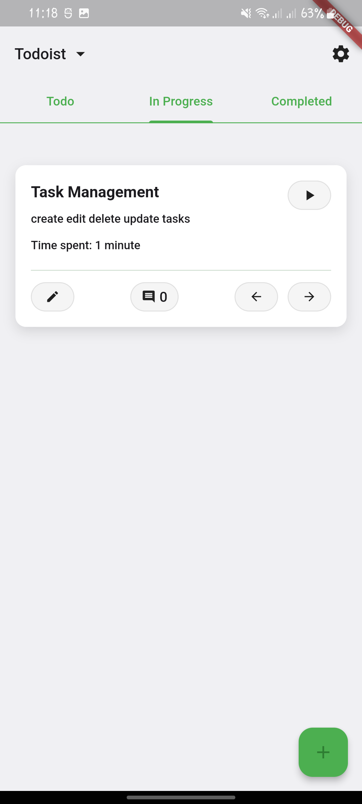
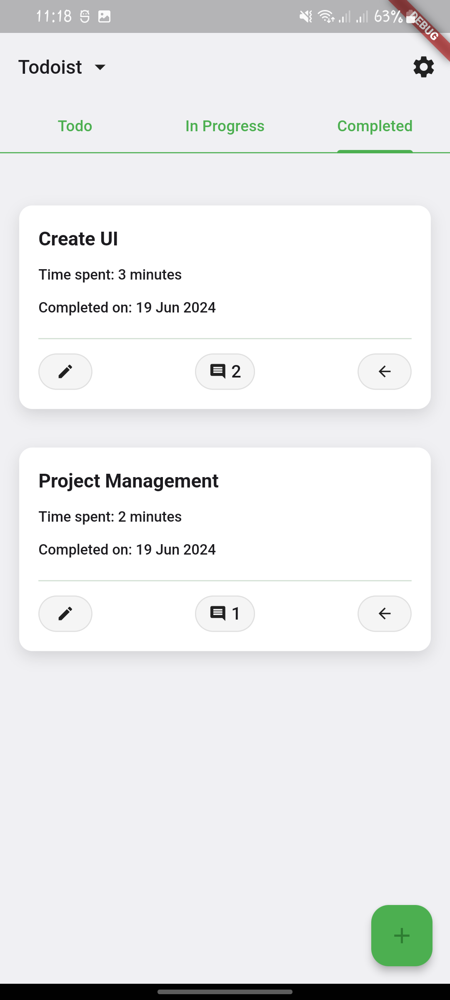
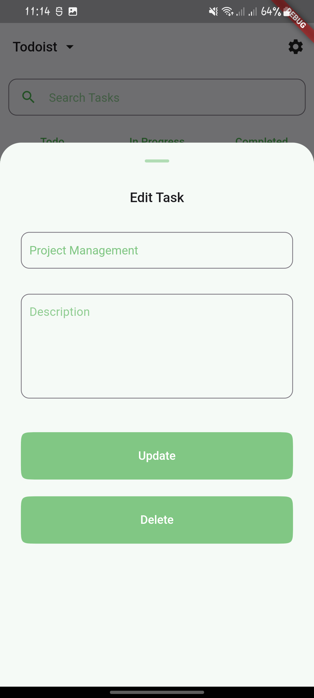
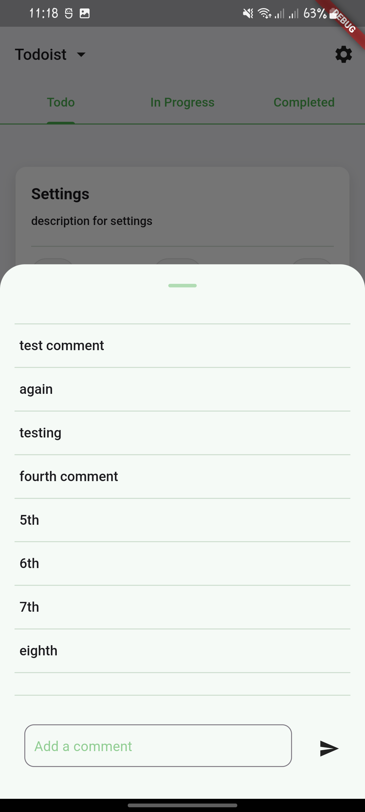

# todoist

Practical Assignment from Innoscripta

## Details

Major Tasks Completed:

- Kanban Board
- Time Tracking
- Column for Completed Tasks
- Comments on Tasks
- UI (No UI provided)
- Dark Mode (In progress)

Total Time Taken: ~12 Hours

## Screenshots

